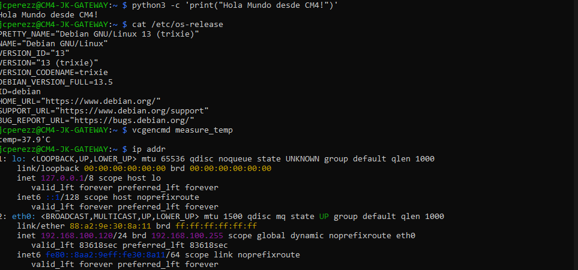
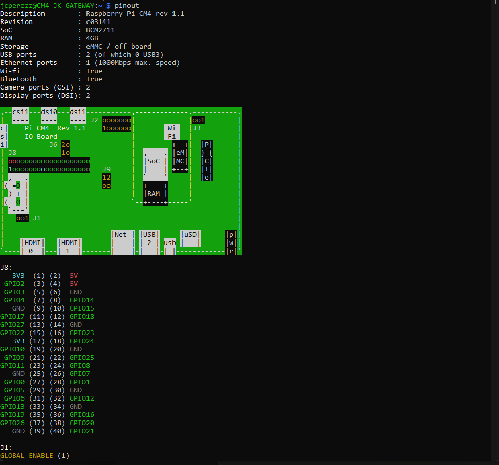
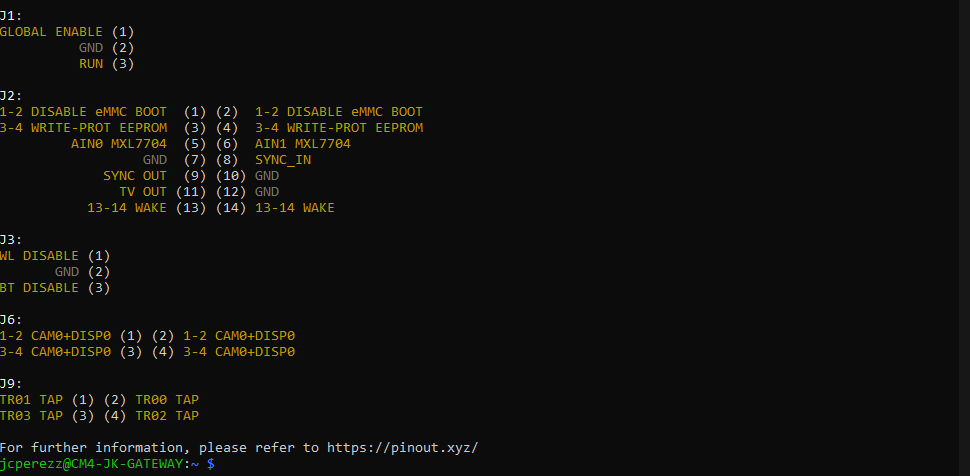

# Guía de Puesta en Marcha: Raspberry Pi CM4 + Waveshare SX1303 LoRaWAN Gateway HAT

## Placas utilizadas

| Componente | Modelo | Amazon ASIN |
|---|---|---|
| Placa base (carrier board) | Waveshare Mini Base Board (A) — CM4-IO-BASE-A | B092D8T71P |
| HAT de gateway LoRa | Waveshare SX1303 915M LoRaWAN Gateway HAT (con módulo GNSS L76K) | B0DKJJJLX5 |
| Módulo de cómputo | Raspberry Pi Compute Module 4 (con eMMC) | (el que ya tenés) |

---

## 1. Lista completa de lo que se necesita

### 1.1 Hardware

- **Raspberry Pi CM4** (con eMMC y/o WiFi, según tu variante).
- **Waveshare CM4-IO-BASE-A** (carrier board / placa base).
- **Waveshare SX1303 915M LoRaWAN Gateway HAT** (con módulo Mini-PCIe y L76K GNSS).
- **Cable USB-C a USB-A** — para conectar la placa base a tu PC y flashear el eMMC.
- **Fuente USB-C de 5V / 2.5A mínimo** — para alimentar la placa base en operación normal (puede ser un cargador de celular USB-C de buena calidad, 5V 3A recomendado).
- **Cable Ethernet RJ45** — para conectar la Pi a tu red local (recomendado para la primera configuración).
- **Antena LoRa 915 MHz** con conector SMA — viene incluida con el HAT normalmente. Verificá que venga una; si no, comprá una antena 915 MHz con conector SMA macho.
- **Antena GPS** — el HAT trae una antena GPS cerámica pasiva. Debe colocarse con la cara **sin etiqueta hacia arriba**, en un lugar con vista al cielo.
- **LilyGo T3 S3 (SX1262, 915 MHz)** — tu dispositivo de prueba LoRa. Ya lo tenés programado con los ejemplos de LilyGo para recepción.
- **Cable USB-C** para el T3 S3 (para alimentarlo y ver el monitor serial).

### 1.2 Herramientas de software (a instalar en tu PC)

| Software | Para qué sirve | Dónde descargarlo |
|---|---|---|
| **Raspberry Pi Imager** | Grabar Raspberry Pi OS en el eMMC del CM4 | [raspberrypi.com/software](https://www.raspberrypi.com/software/) |
| **rpiboot** (RPiBoot Setup) | Hacer que tu PC vea el eMMC del CM4 como un disco USB | Windows: [RPiBoot installer](https://github.com/raspberrypi/usbboot/raw/master/win32/rpiboot_setup.exe). Linux/Mac: compilar desde [github.com/raspberrypi/usbboot](https://github.com/raspberrypi/usbboot) |
| **Cliente SSH** | Conectarte a la Pi sin monitor | Windows: PuTTY o Windows Terminal (ssh viene integrado en Win10/11). Linux/Mac: terminal integrada |
| **Arduino IDE** (ya lo tenés) | Para los sketches del T3 S3 | [arduino.cc](https://www.arduino.cc/en/software) |
| **Monitor serial** | Ver la salida del T3 S3 | El propio Arduino IDE (Serial Monitor) o PuTTY |

### 1.3 Herramientas físicas

- Destornillador Phillips pequeño (si necesitás fijar el CM4 a la placa base con tornillos).
- Nada más. No se necesita soldadura.

---

## 2. Prueba 1 — "Hola Mundo" solo con la Raspberry Pi CM4

### Objetivo

Flashear Raspberry Pi OS en el CM4, arrancar, conectarse por SSH, y ejecutar un script Python que imprima "Hola Mundo" en la terminal.

### 2.1 Identificar el jumper/switch BOOT en la CM4-IO-BASE-A

En la placa CM4-IO-BASE-A, el componente **número 12** en el diagrama del fabricante es el **"BOOT selection"**. Es un **micro-interruptor deslizable (slide switch)** impreso con las marcas **ON** y **OFF** en la placa (serigrafía en la PCB).

**Ubicación física:** está en la zona central-superior de la placa, cerca del borde donde está el conector GPIO de 40 pines (componente 13) y la ranura microSD (componente 14). Buscá un interruptor pequeño (aprox. 3 mm) con las letras "BOOT" impresas al lado.

- **Posición ON:** el CM4 arranca en **modo USB** — esto permite que tu PC vea el eMMC como un disco para flashearlo. **Usá esta posición SOLO para grabar la imagen del sistema operativo.**
- **Posición OFF:** el CM4 arranca **normalmente** desde el eMMC (o desde la microSD si es un CM4 Lite). **Esta es la posición para uso normal.**

### 2.2 Flashear Raspberry Pi OS en el eMMC

> **Nota:** Si tu CM4 es la versión "Lite" (sin eMMC, solo microSD), saltate los pasos 1-5 y simplemente grabá la imagen en una microSD con el Raspberry Pi Imager directamente desde tu PC.

**Paso 1.** Con la placa **apagada y desconectada de todo**, deslizá el switch BOOT a la posición **ON**.

**Paso 2.** Conectá el cable USB-C entre el **puerto USB-C de la CM4-IO-BASE-A** (componente 2, marcado como "5V/2.5A" o "POWER" en la placa — es el único puerto USB-C que hay) y un **puerto USB A de tu PC**.

**Paso 3.** La placa se alimentará por el USB de tu PC (para flasheo no necesitás fuente externa). El LED PWR (componente 11) debería encenderse.

**Paso 4. Ejecutá `rpiboot` en tu PC:**

- **Windows:** abrí el programa "RPiBoot" que instalaste (buscalo en el menú de inicio como "rpiboot"). Se abrirá una ventana de consola que dirá algo como:
  ```
  Waiting for BCM2835/6/7/2711/2712...
  Loading embedded: bootcode4.bin
  Sending bootcode.bin
  Successful read 4 bytes
  ...
  Second stage boot server done
  ```
  Cuando termine, el eMMC del CM4 aparecerá como una nueva unidad de disco en "Este equipo" (como si hubieras conectado una memoria USB).

- **Linux/Mac:**
  ```bash
  sudo apt install libusb-1.0-0-dev   # solo la primera vez (Linux)
  git clone --depth=1 https://github.com/raspberrypi/usbboot
  cd usbboot
  make
  sudo ./rpiboot
  ```
  Esperá hasta que diga que el dispositivo está montado. Aparecerá como `/dev/sdX`.

**Ojo: Fue necesario desconectar el docking de la computadora y conectar esta a la fuente original de ella ya que deba problemas de inestabilidad al reconocer la CM4.**

**Paso 5.** Abrí **Raspberry Pi Imager** en tu PC:

1. En **"Raspberry Pi Device"** seleccioná: **Raspberry Pi 4**.
2. En **"Operating System"** seleccioná: **Raspberry Pi OS (other)** → **Raspberry Pi OS Lite (64-bit)** (sin escritorio — es lo que necesitamos para un gateway).
3. En **"Storage"** seleccioná: el disco que apareció después de correr rpiboot (debería decir algo como "RPi-MSD- ...").
4. **Antes de darle "Write"**, hacé clic en el ícono de **engranaje (⚙️)** o presioná **Ctrl+Shift+X** para abrir la configuración avanzada:
   - **Hostname:** ponele un nombre, por ejemplo `cm4-gateway`.
   - **Enable SSH:** ✅ activá esta opción. Seleccioná **"Use password authentication"**.
   - **Set username and password:** creá tu usuario. Ejemplo: usuario `pi`, contraseña `tucontraseña123` (elegí una propia).
   - **Configure wireless LAN:** si querés WiFi, poné tu SSID y contraseña aquí. Si vas a usar cable Ethernet, podés dejarlo vacío.
   - **Set locale settings:** poné tu zona horaria (America/Costa_Rica) y layout de teclado (es o us).
1. Dale **"Write"** y esperá a que termine. Puede tardar 5-15 minutos.

**Ojo: Daba problemas con la escritura, se tuvo que formatear el disco desde el power shell.**
1. **Se abre el powershell modo administrador** 
2. **Se identifica el disco que representa la raspberri pi** 
     1. **Get-Disk | Select Number,FriendlyName,BusType,OperationalStatus,PartitionStyle,IsReadOnly,IsOffline,Size**
3. **Se coloca lo siguiente**
    1. **diskpart**
    2. **ist disk**
    3. **select disk 1**
    4. **detail disk**
    5. **attributes disk clear readonly**
    6. **clean**
    7. **exit**

**Paso 6.** Cuando el Imager diga "Write Successful":
1. Desconectá el cable USB-C de la PC.
2. Deslizá el switch BOOT de vuelta a la posición **OFF**.
3. Conectá un cable Ethernet entre la CM4-IO-BASE-A y tu router/switch de red.
4. Conectá la fuente USB-C de 5V al puerto USB-C de la placa base para encenderla.

### 2.3 Conectarse por SSH

**Paso 7.** Esperá ~60 segundos para que arranque. Desde tu PC, abrí una terminal y escribí:

```bash
ssh pi@cm4-gateway.local
```

(Usá el hostname y usuario que configuraste en el paso 5. Si `.local` no resuelve, buscá la IP de la Pi en tu router o usá `ping cm4-gateway.local`.)

Te va a pedir la contraseña que configuraste. Escribila (no se muestra mientras escribís) y presioná Enter.

Si todo salió bien, verás el prompt:

```
pi@cm4-gateway:~ $
```

### 2.4 Hola Mundo en Python

**Paso 8.** Ya conectado por SSH, ejecutá:

```bash
python3 -c 'print("Hola Mundo desde CM4!")'
```

Deberías ver:
```
Hola Mundo desde CM4!
```

**Paso 9 (opcional).** Para verificar que todo funciona bien, corré estos comandos de diagnóstico:

```bash
# Ver info del sistema
cat /etc/os-release

# Ver temperatura del CM4
vcgencmd measure_temp

# Ver interfaces de red
ip addr

# Ver GPIOs disponibles
pinout
```


# Resultados 










